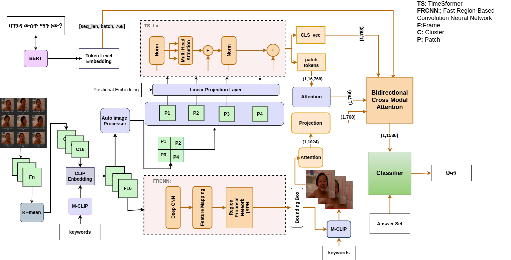

# Multimodal Understanding for Amharic Video Question Answering using Bidirectional Cross Modal Attention

This project proposes a Video Question Answering (VideoQA) system designed specifically for the Amharic language. It integrates multiple modalities—visual frames, object features, and textual data using a bidirectional cross-modal attention mechanism to answer natural language questions based on video content.

## 🎯 Objectives

- Build a functional multimodal QA pipeline for Amharic videos
- Novel Frame Selection Method Based on MCLIP
- Extract visual, object, and textual features for each video
- Train a cross-modal attention model to align vision and language
- Evaluate performance using standard classification metrics

## 📁 Dataset

- **Videos**: Each video is segmented into frames and stored by `video_id`
- **CSV Files**: Include `video_id`, `question`, `answer` (in Amharic)
- **Features**:
  - TimeSformer (CLS token) features
  - Object-level features using FastRCNN
- **Splits**: Training, validation, and test sets are separated

## 🧠 Model

- **Text Encoder**: Amharic BERT
- **Visual Encoders**:
  - CLIP for frame-level features
  - Temporal Video repesentation with TimeSformer
  - FastRCNN for object features
- **Fusion Mechanism**: Bidirectional cross-modal attention (8 heads, 2 layers)
- **Output**: Simple classifier over answer candidates

## 🛠 Training Configuration

- **Loss**: CrossEntropyLoss
- **Optimizer**: Adam
- **Batch Size**: 32
- **Epochs**: 50 with early epoch 5
- **Metrics**: Accuracy, Precision, Recall, F1-score

## 🧪 Evaluation Tasks

- Predict the correct answer for a given Amharic question and video
- Evaluate performance across various feature types and combinations
- Analyze model attention weights to interpret modality contribution

